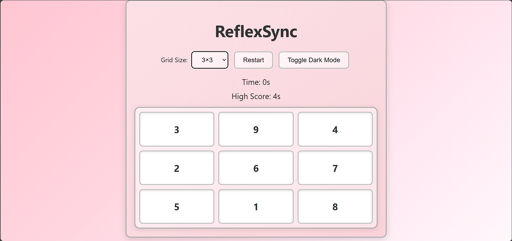
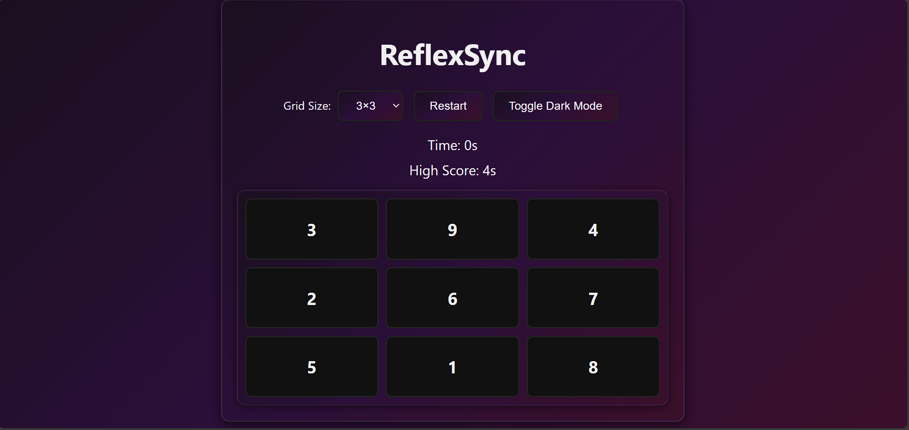
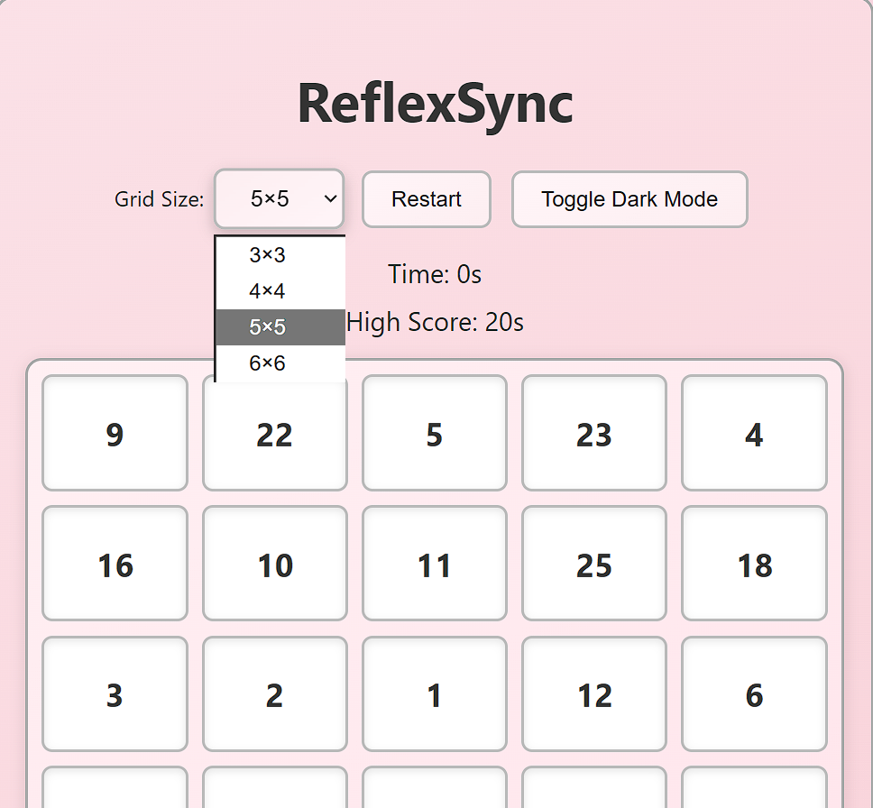

# 🎯 ReflexSync  
🌸 Reflexes, reimagined.           
🌸 Relaxing looks, intense reflex challenge.  

A pastel-themed reflex training game where players must **click highlighted cells in sequence** as quickly as possible.  
The game blends a **minimal UI**, **soft gradients**, and **dark/light themes** with addictive reflex-based gameplay.  

---

## 🎯 Project Objective
To design a **responsive and interactive reflex training game** with multiple grid sizes, light/dark mode, persistent high scores, and smooth animations — all built with **vanilla HTML, CSS, and JavaScript**.

---

## 🚀 Live Demo
🔗 [Play ReflexSync](https://reflexsync.netlify.app/)


---

## 🖥️ Tech Stack
- **HTML5** – Game structure  
- **CSS3** – Pastel gradients, dark/light theme, smooth animations  
- **JavaScript (ES6)** – Core game logic, timer, high scores, sound effects  
- **Canvas-Confetti** – Celebration effect on completion  
- **LocalStorage (optional)** – For saving best scores  

---

## 🌟 Features

### 🎮 Gameplay
- Multiple grid sizes (**3×3**, **4×4**, **5×5**, **6×6**)  
- Click highlighted cells in sequence before time runs out  
- Real-time timer tracking  
- High Score system with local persistence  

### 🎨 Visuals
- **Pastel baby pink gradient** for light mode  
- **Soft gray-black gradient** for dark mode  
- Consistent theme for cells and buttons  
- Smooth animations & confetti on completion  

### ⚙️ Controls
- **Restart button** to reset instantly  
- **Dark/Light toggle** for visual preference  
- Responsive design — playable on desktop & mobile  

### 🔊 Sound Effects
- Click sound  
- Success (on completion)  
- Error (wrong click)   

---

## 📁 Folder Structure
```
reflexsync/
├── index.html       # Main HTML file
├── style.css        # Game styles
├── script.js        # Game logic
├── click.mp3        # Sound effects
├── success.mp3
├── wrong.mp3
├── restart.mp3
├── dark_mode.png
├── light_mode.png
├── grid_options.png
└── README.md        # Project documentation
```

---

## ⚙️ Setup Instructions

### 1. Clone the Repository
```bash
git clone https://github.com/Aadya2901/reflexsync.git
cd reflexsync
```

### 2. Open Locally
```bash
# Option 1: Open index.html in your browser
open index.html

# Option 2: Use Live Server (recommended for dev)
npm install -g live-server
live-server
```

### 3. Deploy (Optional)
- Push repo to GitHub  
- Enable **GitHub Pages** under *Settings → Pages*  
- Or deploy free on **Vercel / Netlify**  

---

## 📸 Screenshots

📸 Screenshots

**Gameplay (Light Mode)**  


**Gameplay (Dark Mode)**  


**Gameplay (Grid Options)**  


---

## 👥 Contributors

| Name                                                | Role                                     |
|-----------------------------------------------------|----------------------------------------- |
| [Aadya2901](https://github.com/Aadya2901)           | Game logic, UI/UX design, responsiveness |

---

## 🤝 Contributing
Contributions are welcome!  

1. Fork this project  
2. Create a feature branch (`git checkout -b feature/YourFeature`)  
3. Commit your changes (`git commit -m 'Add new feature'`)  
4. Push your branch (`git push origin feature/YourFeature`)  
5. Open a Pull Request  

---

## 📝 License
This project is open-source and available under the **MIT License**.  
You are free to use and modify it for personal or educational purposes.  

---

## 💬 Final Note
*"Speed is the key. Can you beat your best reflex time?"*  

Enjoy ReflexSync 🌸⚡  
